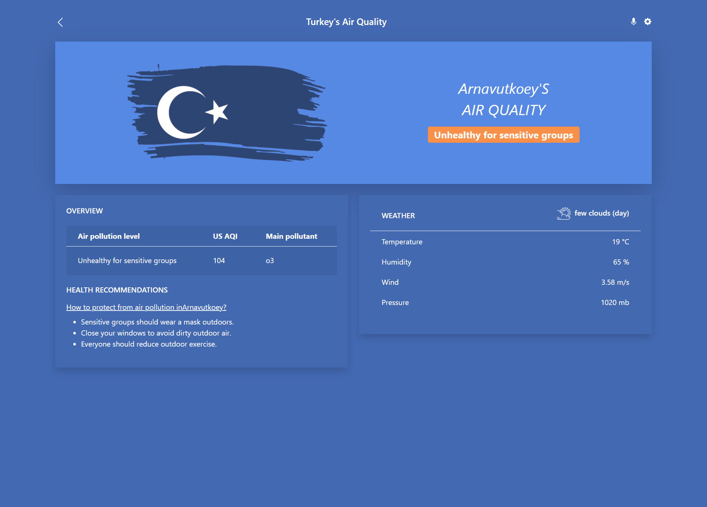

# TURKEY'S AIR QUALITY
## About

A "TURKEY'S AIR QUALITY" is an application that can give information about the air quality, health recommended pieces of advice based on the quality of the air, and the weather for any city in Turkey. It is a Single Page App (SPA). This application was built with React and Redux.

A screenshot of the TURKEY'S AIR QUALITY is presented below:




## Built With

- HTML, CSS, JavaScript.
- React.
- Redux
- VisualStudio Code, Git, & GitHub.

<!-- ## Live Demo

[Live Demo Link]( https://maha-magdy.github.io/egyptian-food-world/ ) -->

## Pre-requisites

- NodeJs
- Git
## Getting Started

To run this project, you only need a computer with a browser installed, and follow these steps:


1. In your terminal, in the folder of your preference, type the following bash command to clone this repository:

```sh
git clone https://github.com/Maha-Magdy/Turkey-Air-Quality.git
```

2. Now that you have already cloned the repo run the following commands to get the project up and running:
```sh
cd Turkey-Air-Quality
npm install
npm start
```
## Author

👤 **Maha Magdy**

- GitHub: [Maha-Magdy](https://github.com/Maha-Magdy)
- Twitter: [@Maha_M_Abdelaal](https://twitter.com/Maha_M_Abdelaal)
- LinkedIn: [Maha Magdy](https://www.linkedin.com/in/maha-magdy-abdelaal/)

## 🤝 Contributing

Contributions, issues, and feature requests are welcome!

Feel free to check the [issues page](https://github.com/Maha-Magdy/Turkey-Air-Quality/issues).

## Acknowledgments

[AirVisual API](https://www.iqair.com/commercial/air-quality-monitors/airvisual-platform/api)
## Show your support

Give a ⭐️ if you like this project!

## 📝 License

This project is [MIT](./LICENSE) licensed.